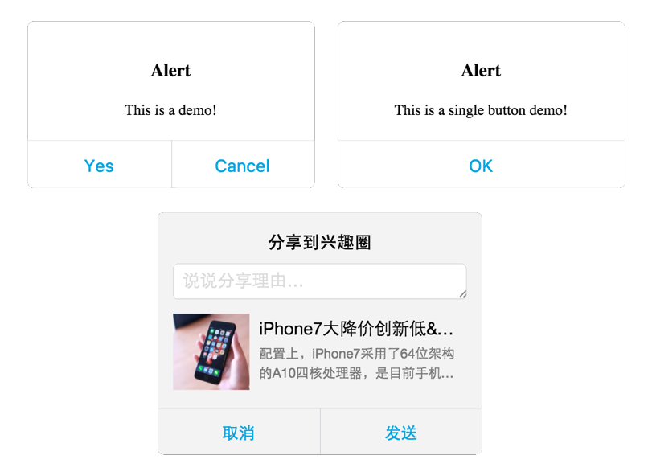

# react-alert
Alert component imitated iOS build with react

## Demo
You can find demo in folder [example](https://github.com/Caesor/react-alert/examples)



## Usage with React

### 1、Install the package
`npm install react-alert --save`

### 2、Using as your need
```
// Example 1:

import React, { Component } from 'react'
import Alert from 'react-alert'

import 'react-ios-alert/dist/react-ios-alert.min.css'

class Main extends Component {
    state = {
        showAlert: false
    }
    render() {
        const alertOpt = {
                title: 'Alert',
                content: 'This is a demo!',
                confirmText: 'Yes',
                cancelText: 'Cancel',
                callback: function(){alert('yes callback called!')},
                cancelCallback: function(){alert('cancel callback called!')},
                close: this.hide.bind(this)
            };
        return (
            <div>
                {
                    !!this.state.showAlert && <Alert {...alertOpt} />
                }
                <button onClick={e=>this.show()}>click me to show Alert</button>
            </div>
        )
    }
    show() {
        this.setState({
            showAlert: true
        })
    }
    hide() {
        this.setState({
            showAlert: false
        })
    }
}

// Example 2:

import { SingleAlert } from 'react-alert'

// You can call SingleAlert.show anywhere and anytime, there will be only one Alert DOM node be added.

SingleAlert.show({
    content: 'Alert实例',
    confirmText: '知道了'
});

setTimeout(() => {
    SingleAlert.hide();
}, 3000)
```
## Configuration
| Param     | Type     | Description |
| :------------- | :------------- | :------------- |
| title       | string       | The brief description of purpose |
| content       | string / JSX       | The detail statement of purpose |
| confirmText       | string       | The text in CONFIRM button |
| cancelText       | string       | The text in CANCEL button |
| confirmAtRight       | bool       | The CONFIRM is at the right of CANCEL button or not |
| callback       | function       | Events called after CONFIRM button is clicked |
| cancelCallback       | function       | Events called after CANCEL button is clicked |
| close       | function       | Use container's method to close the Alert Dialog |
| useTap  | bool       | Use Tap event as default, not Click |

## License
Copyright(c) 2016-2017 AlloyTeam. Licensed under MIT license.
